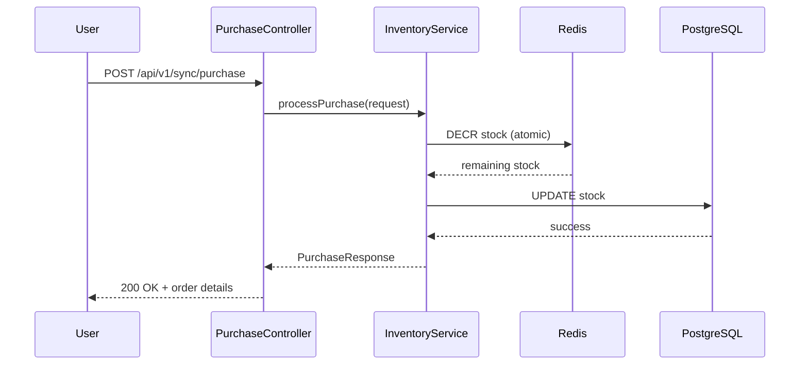
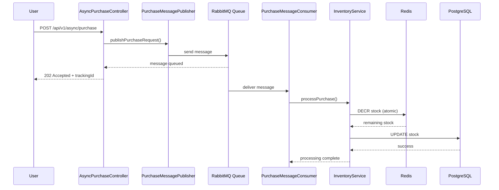

# System Architecture - E-Commerce Flash Sale System

## Table of Contents
1. [System Overview](#system-overview)
2. [Architecture Patterns](#architecture-patterns)
3. [Technology Stack](#technology-stack)
4. [Component Architecture](#component-architecture)
5. [Data Flow Diagrams](#data-flow-diagrams)
6. [Infrastructure Design](#infrastructure-design)
7. [Scalability Considerations](#scalability-considerations)
8. [Security Considerations](#security-considerations)

## System Overview

The PulseCart Backend Communication Patterns system is designed to handle high-concurrency flash sales where thousands of users attempt to purchase limited inventory simultaneously. The system implements two distinct communication patterns to demonstrate different approaches to handling massive concurrent load.

### Business Context
- **Scenario**: E-commerce flash sale (e.g., Black Friday, product launches)
- **Challenge**: 100,000+ concurrent users purchasing 1,000 limited items in 5 minutes
- **Critical Requirements**:
  - Prevent overselling (stock never goes negative)
  - Handle extreme concurrency without system failure
  - Provide real-time feedback to users
  - Maintain data consistency

## Architecture Patterns

### Pattern 1: Synchronous HTTP Request-Response
**Use Case**: Immediate purchase confirmation required
**Characteristics**:
- Blocking operation with immediate response
- Strong consistency guarantees
- Simple to implement and debug
- Limited scalability under extreme load

### Pattern 2: Asynchronous Message Queue
**Use Case**: High throughput with eventual consistency
**Characteristics**:
- Non-blocking request acceptance
- Decoupled processing architecture
- Better scalability for burst traffic
- Complex error handling and monitoring

## Technology Stack

### Core Framework
- **Spring Boot 3.5.7**: Enterprise-grade Java framework
- **Java 17**: Modern JVM with performance optimizations

### Data Layer
- **PostgreSQL**: ACID-compliant relational database
- **Redis**: In-memory data store for atomic operations
- **Flyway**: Database migration management

### Messaging & Communication
- **RabbitMQ**: Message broker with advanced routing
- **Spring AMQP**: RabbitMQ integration for Spring

### Infrastructure
- **Docker & Docker Compose**: Containerized deployment
- **Maven**: Build and dependency management

### Monitoring & Observability
- **Spring Boot Actuator**: Application metrics
- **SLF4J + Logback**: Structured logging

## Component Architecture

### Layered Architecture

```
┌─────────────────────────────────────────┐
│         Presentation Layer              │
│  ┌─────────────────────────────────────┐ │
│  │  REST Controllers                   │ │
│  │  • PurchaseController (Sync)       │ │
│  │  • AsyncPurchaseController (Async) │ │
│  └─────────────────────────────────────┘ │
└─────────────────────────────────────────┘
                    │
                    ▼
┌─────────────────────────────────────────┐
│         Service Layer                   │
│  ┌─────────────────────────────────────┐ │
│  │  Business Logic                     │ │
│  │  • InventoryService                 │ │
│  │  • Purchase Processing              │ │
│  └─────────────────────────────────────┘ │
└─────────────────────────────────────────┘
                    │
                    ▼
┌─────────────────────────────────────────┐
│         Data Access Layer               │
│  ┌─────────────────────────────────────┐ │
│  │  Repositories & Caching             │ │
│  │  • ProductRepository (JPA)         │ │
│  │  • Redis Operations                 │ │
│  └─────────────────────────────────────┘ │
└─────────────────────────────────────────┘
                    │
                    ▼
┌─────────────────────────────────────────┐
│         Infrastructure Layer            │
│  ┌─────────────────────────────────────┐ │
│  │  External Systems                   │ │
│  │  • PostgreSQL Database             │ │
│  │  • Redis Cache                      │ │
│  │  • RabbitMQ Message Broker          │ │
│  └─────────────────────────────────────┘ │
└─────────────────────────────────────────┘
```

### Component Responsibilities

#### Controllers
- **PurchaseController**: Synchronous purchase endpoint
- **AsyncPurchaseController**: Asynchronous purchase endpoint
- **Validation**: Input validation using Bean Validation
- **Response Formatting**: Consistent API responses

#### Services
- **InventoryService**: Core business logic for stock management
- **Atomic Operations**: Redis-based stock decrement
- **Error Handling**: Comprehensive exception management

#### Messaging Components
- **PurchaseMessagePublisher**: Sends messages to RabbitMQ
- **PurchaseMessageConsumer**: Processes queued messages
- **Stock Update Publisher**: Broadcasts inventory changes

#### Configuration
- **RedisConfig**: Multiple Redis templates for different use cases
- **RabbitMQConfig**: Queues, exchanges, and bindings
- **ThreadPoolConfig**: Executor service for concurrency

## Data Flow Diagrams

### Synchronous Purchase Flow



**Flow Characteristics**:
- Blocking operation
- Immediate consistency
- Single transaction scope
- Direct user feedback

### Asynchronous Purchase Flow



**Flow Characteristics**:
- Non-blocking acceptance
- Decoupled processing
- Eventual consistency
- Background processing

## Infrastructure Design

### Docker Compose Architecture

```yaml
version: '3.8'
services:
  postgres:      # Data persistence
  redis:         # Atomic operations & caching
  rabbitmq:      # Message queuing
  app:           # Spring Boot application
  load-balancer: # nginx/HAProxy (future)
```

### Network Architecture

```
┌─────────────────┐    ┌─────────────────┐
│   Load Balancer │    │   Application   │
│    (nginx)      │────│   Instances     │
│                 │    │  (Spring Boot)  │
└─────────────────┘    └─────────────────┘
         │                       │
         │                       │
┌─────────────────┐    ┌─────────────────┐
│     Redis       │    │   PostgreSQL    │
│   (Cache)       │    │   (Database)    │
└─────────────────┘    └─────────────────┘
         │
         │
┌─────────────────┐
│   RabbitMQ      │
│ (Message Queue) │
└─────────────────┘
```

### Database Schema

```sql
-- Product inventory table
CREATE TABLE product (
    id BIGINT PRIMARY KEY,
    name VARCHAR(100) NOT NULL,
    stock_quantity INTEGER NOT NULL,
    price DECIMAL(10,2),
    created_at TIMESTAMP,
    updated_at TIMESTAMP
);

-- Indexes for performance
CREATE INDEX idx_product_stock ON product(stock_quantity);
```

### Redis Key Design

```
product:stock:{id}     → Stock quantity (atomic operations)
product:info:{id}      → Product metadata (JSON)
order:{orderId}        → Order details
session:user:{userId}  → User session data
```

### RabbitMQ Topology

```
┌─────────────────┐     ┌─────────────────┐
│ Purchase Queue  │────▶│  DLQ (Failed)  │
│                 │     │                 │
└─────────────────┘     └─────────────────┘
         │
         ▼
┌─────────────────┐
│ Stock Update    │
│ Exchange        │
└─────────────────┘
```

## Scalability Considerations

### Horizontal Scaling
- **Application Layer**: Multiple Spring Boot instances behind load balancer
- **Database Layer**: Read replicas for inventory queries
- **Cache Layer**: Redis cluster for distributed caching
- **Message Queue**: RabbitMQ cluster for high availability

### Performance Optimizations
- **Connection Pooling**: Configured for database and Redis
- **Thread Pools**: Optimized for concurrent request handling
- **Caching Strategy**: Redis for hot data, database for persistence
- **Async Processing**: Non-blocking I/O for better resource utilization

### Load Distribution Strategies

#### Round Robin
- Simple distribution algorithm
- Equal load across instances
- No session affinity required

#### Least Connections
- Intelligent load balancing
- Routes to least loaded instance
- Better resource utilization

### Capacity Planning

| Component | Concurrent Users | TPS | Resource Requirements |
|-----------|------------------|-----|----------------------|
| Spring Boot | 10,000 | 2,000 | 4 CPU, 8GB RAM |
| PostgreSQL | 10,000 | 5,000 | 8 CPU, 32GB RAM |
| Redis | 10,000 | 50,000 | 4 CPU, 16GB RAM |
| RabbitMQ | 10,000 | 10,000 | 4 CPU, 8GB RAM |

## Security Considerations

### Authentication & Authorization
- JWT tokens for user authentication
- Role-based access control (RBAC)
- API key validation for service-to-service calls

### Data Protection
- Input validation and sanitization
- SQL injection prevention (JPA/Hibernate)
- XSS protection in responses
- Sensitive data encryption at rest

### Network Security
- HTTPS/TLS encryption
- API rate limiting
- CORS configuration
- Firewall rules for infrastructure

### Operational Security
- Secure configuration management
- Audit logging for sensitive operations
- Regular security updates
- Container image scanning

## Monitoring & Observability

### Application Metrics
- Request latency (p50, p95, p99)
- Error rates by endpoint
- Thread pool utilization
- Memory and CPU usage

### Infrastructure Monitoring
- Database connection pools
- Redis memory usage
- Queue depths and processing rates
- Network I/O metrics

### Business Metrics
- Purchase success rates
- Inventory turnover
- User experience metrics
- Revenue tracking

## Deployment Strategy

### Blue-Green Deployment
- Zero-downtime deployments
- Gradual traffic shifting
- Rollback capability

### Canary Releases
- Percentage-based traffic routing
- Feature flag management
- A/B testing capabilities

### Configuration Management
- Environment-specific configurations
- Secret management
- Feature toggles

## Disaster Recovery

### Data Backup
- PostgreSQL automated backups
- Redis persistence configuration
- Cross-region replication

### High Availability
- Multi-zone deployment
- Load balancer health checks
- Automatic failover

### Incident Response
- Alerting and notification
- Runbooks for common issues
- Post-mortem process

## Conclusion

This architecture provides a robust, scalable solution for high-concurrency flash sales while demonstrating two distinct communication patterns. The synchronous approach offers simplicity and immediate consistency, while the asynchronous approach provides better scalability for extreme load scenarios.

The modular design allows for independent scaling of components and easy maintenance. Comprehensive monitoring and security measures ensure reliable operation in production environments.
